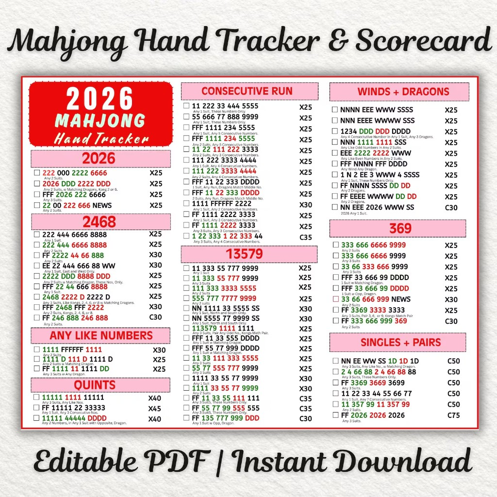

# 2026 American Mahjong Hand Card

Digitized from the **Mahjong Hand Tracker & Scorecard — 2026** (NMJL-style layout).  
This is the source of truth for Mahjon’s winning hands.

## How to read the card

| Symbol | Meaning |
|--------|---------|
| **1–9** | Number tiles (Shell/Crak, Kelp/Bam, Pearl/Dot) |
| **0** | White Dragon / Soap / Pearl Dragon (year “zero”) |
| **F** | Flower / Anemone |
| **N E W S** | Winds |
| **D** | Dragon (Coral/Red, Wave/Green, Pearl/White) |
| **NEWS** | One of each wind (N+E+W+S) |
| **X##** | May be exposed; point value |
| **C##** | Must stay concealed (except the winning tile); point value |

**Colors on a printed card** = different suits.  
In this file, suit notes say “Any 1 Suit”, “Any 2 Suits”, etc.

**Matching Dragons** = dragon color follows the suit (Red↔Crak, Green↔Bam, White↔Dot).  
**Opposite / Opp. Dragon** = dragon is *not* the matching color for that suit.

**Jokers** may stand in for tiles only inside groups of **3+** (pung/kong/quint/sextet). Never in singles, pairs, or NEWS.

---

## 2026 (4 hands)

| # | Pattern | Notes | Value |
|---|---------|-------|-------|
| 1 | `222 000 2222 6666` | Any 2 Suits | X25 |
| 2 | `2026 DDD 2222 DDD` | Any 2 Suits, Matching Dragons; Kong is 2 or 6 | X25 |
| 3 | `FFF 2026 222 6666` | Any 3 Suits | X25 |
| 4 | `22 00 222 666 NEWS` | Any 2 Suits | X30 |

---

## 2468 (9 hands)

| # | Pattern | Notes | Value |
|---|---------|-------|-------|
| 1 | `222 444 6666 8888` | Any 1 Suit | X25 |
| 2 | `222 444 6666 8888` | Any 2 Suits | X25 |
| 3 | `FF 2222 44 66 8888` | Any 2 Suits | X30 |
| 4 | `EE 22 444 666 88 WW` | Any 1 Suit; East & West only | X30 |
| 5 | `2222 DDD 8888 DDD` | Any 2 Suits, Matching Dragons; these numbers only | X25 |
| 6 | `FFF 22 44 666 8888` | Any 1 Suit | X25 |
| 7 | `2468 2222 D 2222 D` | Any 3 Suits; like Kongs of 2/4/6/8 with Matching Dragons | X25 |
| 8 | `FFF 2468 FFF 2222` | Any 2 Suits; Kong is 2, 4, 6, or 8 | X30 |
| 9 | `FF 246 888 246 888` | Any 2 Suits | C30 |

---

## Any Like Numbers (3 hands)

| # | Pattern | Notes | Value |
|---|---------|-------|-------|
| 1 | `1111 FFFFFF 1111` | Any 2 Suits (sextet of flowers) | X30 |
| 2 | `1111 D 111 D 1111 D` | Any 3 Suits with Matching Dragons | X25 |
| 3 | `FF 1111 11 1111 DD` | Any 3 Suits with any Dragon pair | X25 |

---

## Quints (3 hands)

| # | Pattern | Notes | Value |
|---|---------|-------|-------|
| 1 | `11111 1111 11111` | Any 3 Suits; any like numbers | X40 |
| 2 | `FF 11111 22 33333` | Any 1 Suit; any 3 consecutive numbers | X45 |
| 3 | `11111 44444 DDDD` | Any 2 numbers in any 1 suit with Opposite Dragon | X40 |

---

## Consecutive Run (13 hands)

| # | Pattern | Notes | Value |
|---|---------|-------|-------|
| 1 | `11 222 33 444 5555` | Any 1 Suit; these numbers only | X25 |
| 2 | `55 666 77 888 9999` | Any 1 Suit; these numbers only | X25 |
| 3 | `FFF 1111 234 5555` | Any 1 Suit; any 5 consecutive | X25 |
| 4 | `FFF 1111 234 5555` | Any 2 Suits; any 5 consecutive | X25 |
| 5 | `11 22 111 222 3333` | Any 2 Suits; any 3 consecutive | X25 |
| 6 | `111 222 3333 4444` | Any 1 Suit; any 4 consecutive | X25 |
| 7 | `111 222 3333 4444` | Any 2 Suits; any 4 consecutive | X25 |
| 8 | `FFF 11 22 333 DDDD` | 1 Suit; any run of 3; dragons match middle number | X25 |
| 9 | `FFF 11 22 333 DDDD` | 2 Suits; any run of 3; dragons match middle number | X25 |
| 10 | `1111 FFFFFF 2222` | Any 1 Suit; any 2 consecutive | X30 |
| 11 | `FF 1111 2222 3333` | Any 1 Suit; any 3 consecutive | X25 |
| 12 | `FF 1111 2222 3333` | Any 3 Suits; any 3 consecutive | X25 |
| 13 | `1 22 333 1 22 333 44` | Any 3 Suits; any 4 consecutive | C35 |

---

## 13579 (16 hands)

| # | Pattern | Notes | Value |
|---|---------|-------|-------|
| 1 | `11 333 55 777 9999` | Any 1 Suit | X25 |
| 2 | `11 333 55 777 9999` | Any 3 Suits | X25 |
| 3 | `111 333 3333 5555` | Any 2 Suits | X25 |
| 4 | `555 777 7777 9999` | Any 2 Suits | X25 |
| 5 | `NN 1111 33 5555 SS` | Any 1 Suit; North & South only | X30 |
| 6 | `NN 5555 77 9999 SS` | Any 1 Suit; North & South only | X30 |
| 7 | `113579 1111 1111` | Any 3 Suits; pair any odd; Kongs match the pair | X25 |
| 8 | `FFF 11 33 555 DDDD` | Any 1 Suit with Matching Dragon | X25 |
| 9 | `FFF 55 77 999 DDDD` | Any 1 Suit with Matching Dragon | X25 |
| 10 | `11 33 111 333 5555` | Any 2 Suits | X25 |
| 11 | `55 77 555 777 9999` | Any 2 Suits | X25 |
| 12 | `1111 33 55 77 9999` | Any 2 Suits | X30 |
| 13 | `1111 33 55 77 9999` | Any 3 Suits | X30 |
| 14 | `FF 11 33 55 111 111` | Any 3 Suits; these numbers only | C35 |
| 15 | `FF 55 77 99 555 555` | Any 3 Suits; these numbers only | C35 |
| 16 | `FF 135 777 999 DDD` | Any 1 Suit with Opposite Dragon | C30 |

---

## Winds + Dragons (10 hands)

| # | Pattern | Notes | Value |
|---|---------|-------|-------|
| 1 | `NNNN EEE WWW SSSS` | — | X25 |
| 2 | `NNN EEEE WWWW SSS` | — | X25 |
| 3 | `1234 DDD DDD DDDD` | Any 4 consecutive in 1 suit; three dragon colors | X25 |
| 4 | `NNN 1111 1111 SSS` | Any like odd numbers in any 2 suits | X25 |
| 5 | `EEE 2222 2222 WWW` | Any like even numbers in any 2 suits | X25 |
| 6 | `FFF NNNN FFF DDDD` | Any wind; any dragon | X25 |
| 7 | `1 N 2 EE 3 WWW 4 SSSS` | Any 1 Suit; these numbers only | X25 |
| 8 | `FF NNNN SSSS DD DD` | Any 2 different dragons | X25 |
| 9 | `FF EEEE WWWW DD DD` | Any 2 different dragons | X25 |
| 10 | `NN EEE 2026 WWW SS` | 2026 in any 1 suit | C30 |

---

## 369 (8 hands)

| # | Pattern | Notes | Value |
|---|---------|-------|-------|
| 1 | `333 666 6666 9999` | Any 2 Suits | X25 |
| 2 | `333 666 6666 9999` | Any 3 Suits | X25 |
| 3 | `33 66 333 666 9999` | Any 3 Suits | X25 |
| 4 | `FFF 33 666 99 DDDD` | 1 Suit with Matching Dragon | X25 |
| 5 | `FFF 33 666 99 DDDD` | 1 Suit with Opposite Dragon | X25 |
| 6 | `33 66 666 999 NEWS` | Any 2 Suits | X30 |
| 7 | `FF 3369 3333 3333` | Any 3 Suits; pair 3/6/9; Kongs match pair | X25 |
| 8 | `FF 333 666 999 369` | Any 2 Suits | C30 |

---

## Singles + Pairs (6 hands)

All concealed. **No jokers** in these hands (pairs/singles only).

| # | Pattern | Notes | Value |
|---|---------|-------|-------|
| 1 | `NN EE WW SS 1D 1D 1D` | Any like number with Matching Dragons | C50 |
| 2 | `2 4 66 88 2 4 66 88 88` | Any 3 Suits; these numbers only | C50 |
| 3 | `FF 3369 3669 3699` | Any 3 Suits | C50 |
| 4 | `11 22 33 44 55 66 77` | Any 1 Suit; any 7 consecutive | C50 |
| 5 | `11 357 99 11 357 99` | Any 2 Suits | C50 |
| 6 | `FF 2026 2026 2026` | Any 3 Suits | C75 |

---

## Totals

| Category | Hands |
|----------|------:|
| 2026 | 4 |
| 2468 | 9 |
| Any Like Numbers | 3 |
| Quints | 3 |
| Consecutive Run | 13 |
| 13579 | 16 |
| Winds + Dragons | 10 |
| 369 | 8 |
| Singles + Pairs | 6 |
| **Total** | **72** |

---

## Mahjon implementation notes

- Point values are **fun score** (no cash settlements).
- Hands marked **C** must be concealed.
- “Any consecutive” lines are implemented with a rank shift so every legal run is accepted.
- Table rules that always apply: no jokers in Charleston; jokers only in 3+ groups; claim priority Mahjong → Quint → Kong → Pung.
